# CI/CD Pipeline with Automated Docker Security Scanning and Deployment to Kubernetes

## Project Overview:
This project implements a secure CI/CD pipeline using Jenkins, Docker, Trivy, and Kubernetes. The pipeline ensures that **only secure Docker images** are deployed to production by automatically scanning for vulnerabilities.

---
## Architecture Diagram:
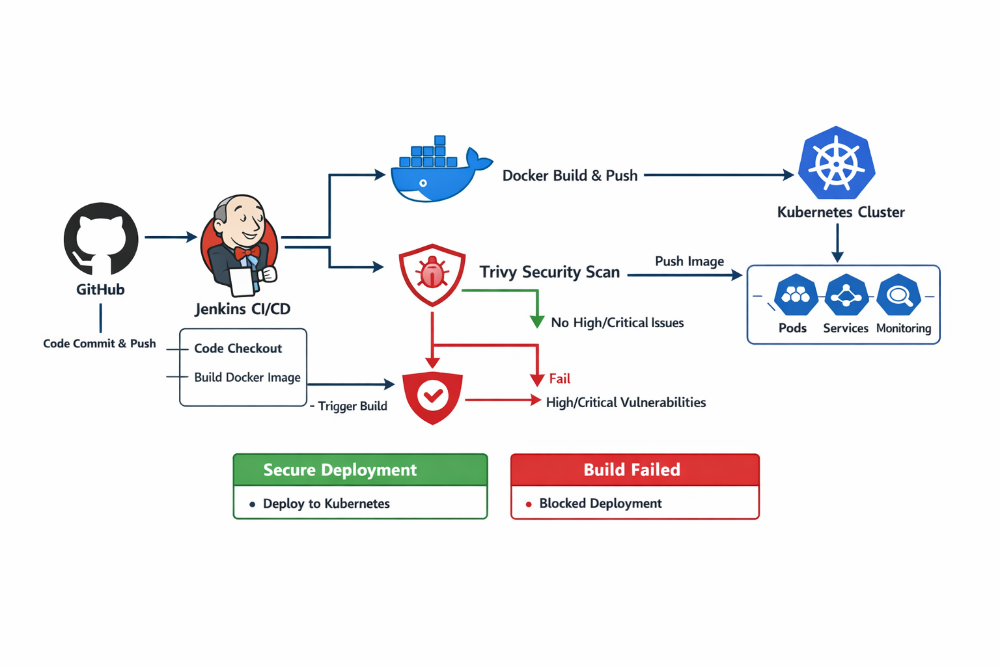

---
## Technologies Used:
- Docker – Containerization  
- Jenkins – CI/CD automation  
- Kubernetes – Deployment and service orchestration  
- Trivy – Vulnerability scanning tool  
- GitHub – Source code management  

---
## Pipeline Workflow:
1. Code Checkout – Pull latest code from GitHub  
2. Build Docker Image – Containerize application  
3. Trivy Security Scan – Scan Docker image for high/critical vulnerabilities  
4. Pipeline Gating – Fail pipeline if high-severity vulnerabilities found  
5. Docker Push – Push secure image to DockerHub  
6. Kubernetes Deployment – Deploy only secure images to cluster  

---
## Security Validation Logic:
- High and Critical vulnerabilities detected by Trivy **fail the pipeline** automatically.  
- Only images with **no high/critical vulnerabilities** are allowed to push to DockerHub and deploy to Kubernetes.  
- Vulnerable dependencies must be updated before deployment.  
- Security gating ensures **production environment remains safe** from exploitable vulnerabilities.  

---
## Screenshots:
1. Instance Running
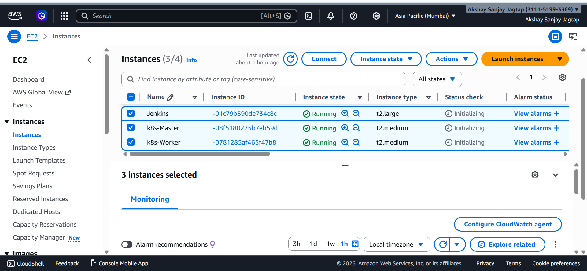
2. Jenkins Pipeline Trigger  
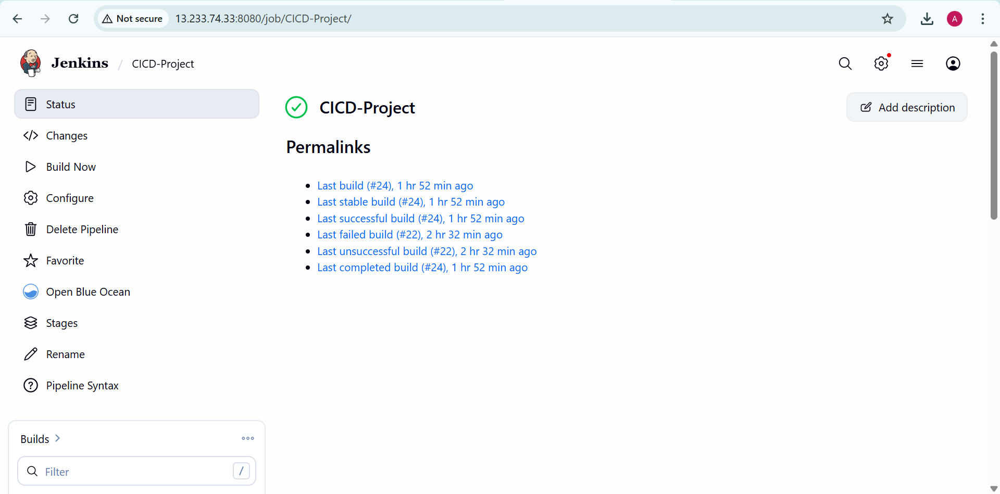  

3. Jenkins Pipeline Success  
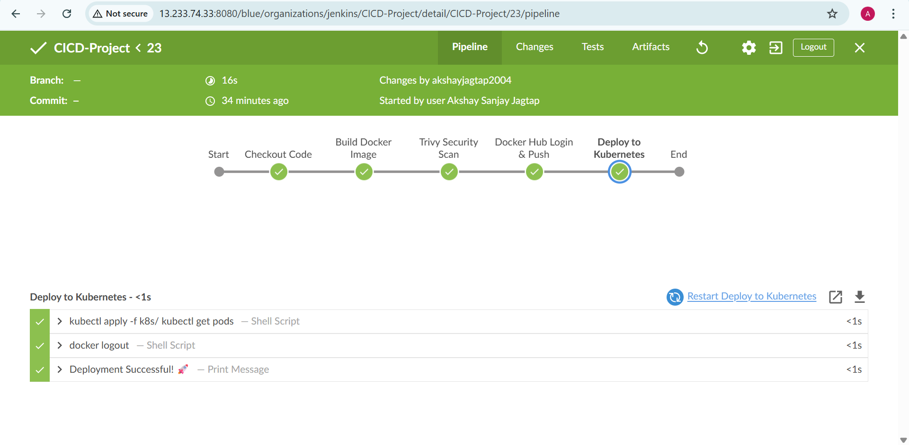  

4. Jenkins Pipeline Failure  
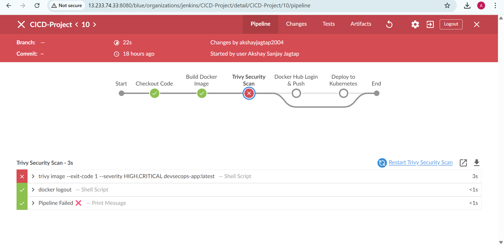  

5. Trivy Scan Report  
run:
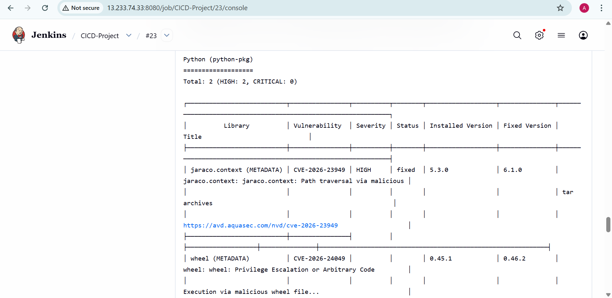  
error:
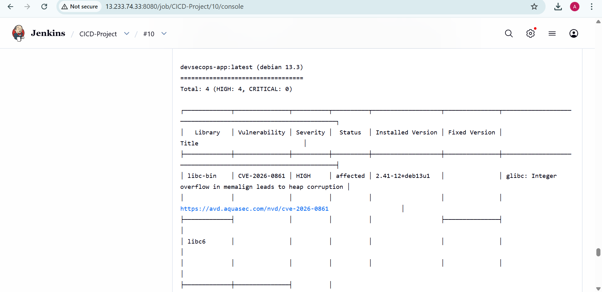

6. DockerHub Image Push  
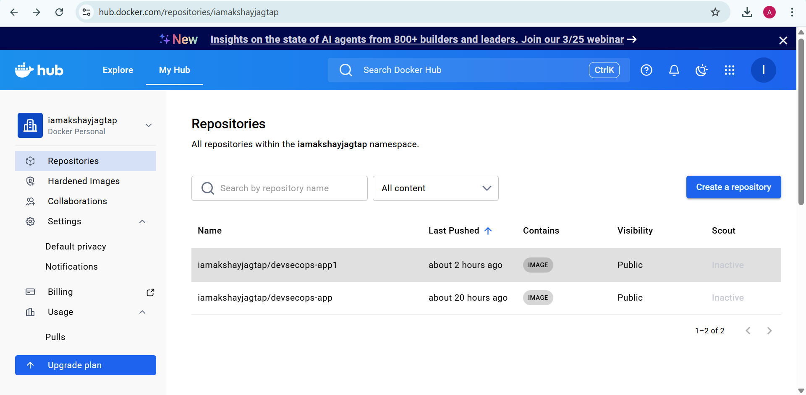  

7. Kubernetes Pods Status  
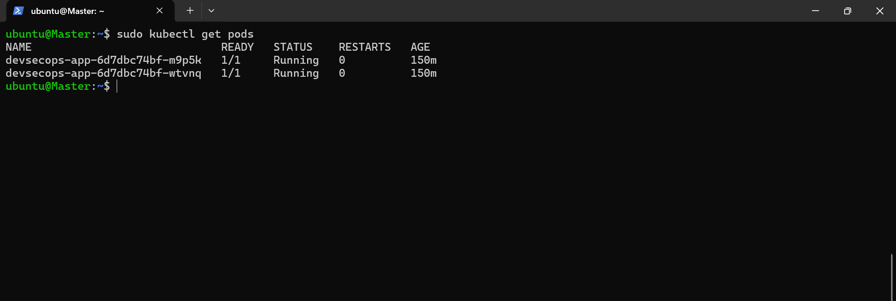  

8. Kubernetes Services Status  
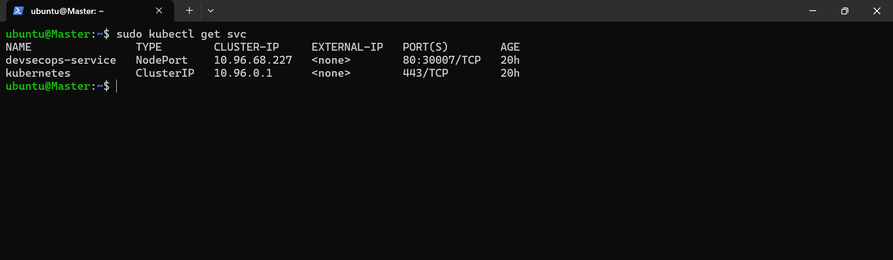  

9. Output  
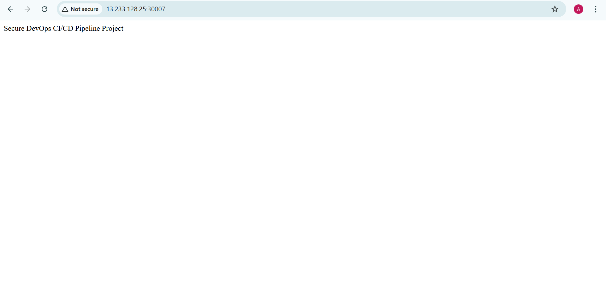  

---
## Deployment Workflow:
1. Commit code to GitHub  
2. Jenkins automatically triggers the pipeline  
3. Docker image is built and scanned  
4. If scan passes, image is pushed to DockerHub  
5. Kubernetes deployment applied using `kubectl apply -f k8s/`  

---
## How to Use:
1. Clone repository:  
```bash
git clone <https://github.com/IamAkshayjagtap/CI-CD-Pipeline-with-Automated-Docker-Security-Scanning-and-Deployment-to-Kubernetes.git>
```

---
## Conclusion:

This project demonstrates **end-to-end CI/CD automation** with integrated security checks. By combining Jenkins, Docker, Trivy, and Kubernetes, the pipeline ensures that **only secure and tested images reach production**, minimizing risks and improving deployment reliability.

Security gating, automated scanning, and controlled deployment ensure that **DevOps processes are secure, reliable, and efficient.**

---